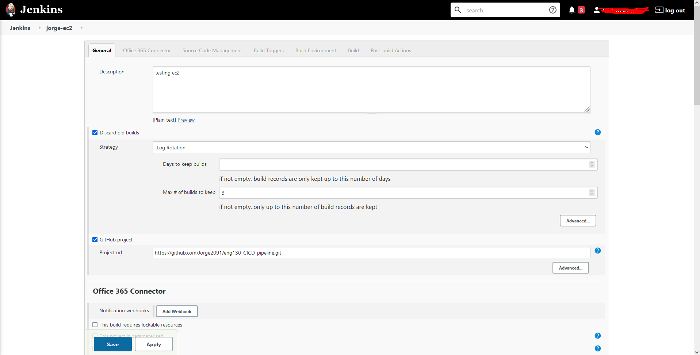
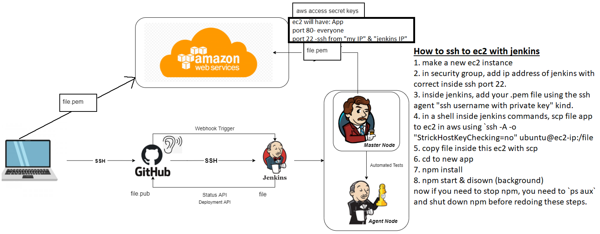

## What is CI CD
CI/CD stands for Continuous Integration/Continuous Delivery, is the backbone of the benefits of integrating DevOps methodology. It helps push and deploy more codes faster. At the same time, the team can have instance feedback and make changes if necessary.
## Difference between continuous delivery and continuous deployment 
Deployment goes one step further by applying all stages of the production pipeline to the release where in continuous delivery, its happens in steps manually.
## What is webhook
Webhook in jenkins is a mechanism that automatically trigger the build of a jenkins project in response to a commit pushed to a Git repository

## Steps for jenkins
- create a new ssh key pair called - copy eng130_jenkins_jorge, eng130_jenkins_jorge.pub
### steps

1. create a new CICD pipeline
2. generate a new ssh key pair (ensure to generate it in .ssh folder on localhost)
3. copy file.pub to github repo
4. copy the private key in jenkins
5. create a new job to test the CI
Now your jenkins have connection to your github and can pull and push new code as well as merge them.
6. create a webhook by going repository in git 
7. go to settings of the repository
8. go webhooks
9. add webhook >payload URL: URL, json type and no secret. only push event

## Testing with jenkins
to make testing with jenkins, you make a new job/item. This bring a new page where you can insert instruction. first connect the https of your repo, this will allow jenkins to know where to clone as shown below

After this, you can go to source code management where it acts as VS_code and the repo is in. You also need to make sure that you have your credentials correctly, as shown in "steps for jenkins" above. you can also use <a href="https://github.com/Jorge2091/git_github_setup/tree/main/ssh_setup">This repo</a>
Inside management, you can also have the ability to merge branches to main branch by adding a behaviors below.

1. connect your repository to the job, this will clone your repository and cd inside
2. on source code management, keys with your ssh repository link
3. trigger when webhook is activated `build triggers`
4. provide node & npm (this was done for us, just put the settings on build Environment)
5. `cd app & npm install & npm test`
the last command will go inside the app folder and start the test inside test file

## connecting to ec2 with jenkins
The first step is to make sure your security is correctly identified for jenkins IP to ssh, this is also know as port 22.
1. make a new ec2 instance
2. in security group, add ip address of jenkins with correct inside ssh port 22.
3. inside jenkins, add your .pem file using the ssh agent "ssh username with private key" kind.
4. in a shell inside jenkins commands, and rsync files
5. ssh into ec2 with `ssh -o "StrictHostKeyChecking=no" ubuntu@ip << EOF`
6. cd to new app
7. npm install
8. `npm start & disown` or `nohup node app.js > /dev/null 2>&1 &` (background)
now if you need to stop npm, you need to `ps aux` and shut down npm before redoing these steps.


## Functions to sync files from jenkins to aws
inside jenkins shell information
```bash
rsync -avz -e "ssh -o StrictHostKeyChecking=no" app ubuntu@ip:/home/ubuntu
rsync -avz -e "ssh -o StrictHostKeyChecking=no" environment ubuntu@ip:/home/ubuntu
ssh -o "StrictHostKeyChecking=no" ubuntu@ip <<EOF
    sudo killall -9 node

    cd app
    npm install
    nohup node app.js > /dev/null 2>&1 &
EOF
```
### connect database
Use an db AMI inside aws to run the database and launch the instance
1. start new job
2. ssh into app ec2(look at the above lines)
3. you will be located in ~
4. `echo "export DB_HOST=mongodb://IP:27017/posts" >> ~/.bashrc` this will line an extra line to make variable DB_HOST
